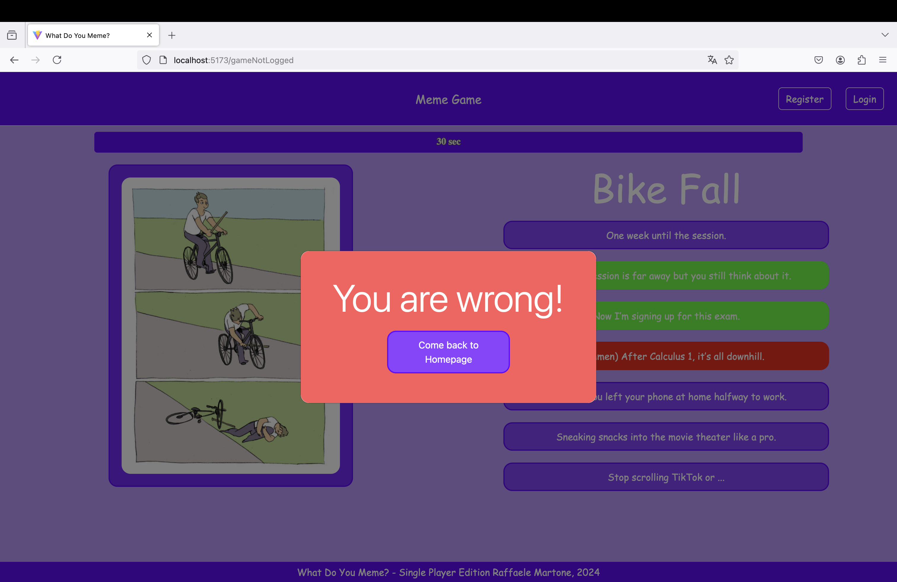
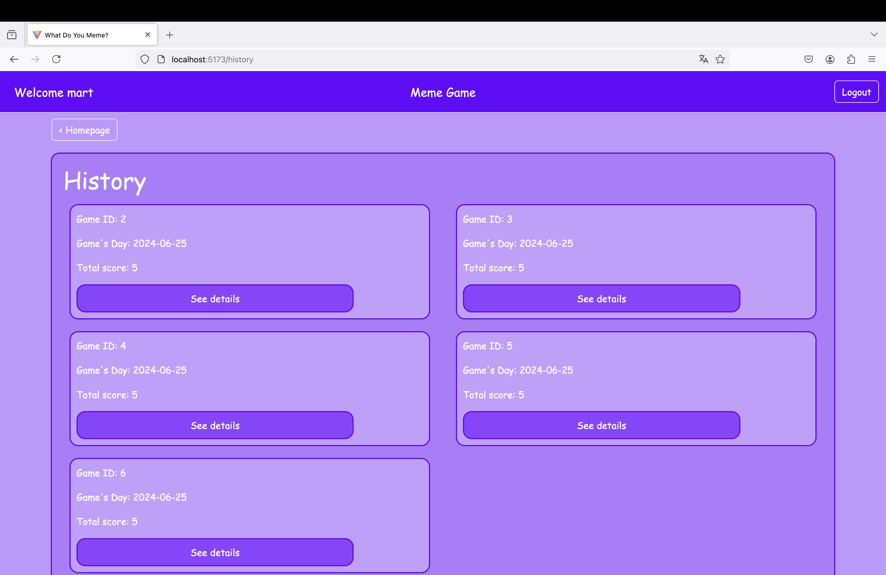

# Exam #1: "Meme Game"
## Student: s324807 Martone Raffaele 

# Table of Contents
- [Exam #1: "Meme Game"](#exam-1-meme-game)
  - [Student: s324807 Martone Raffaele](#student-s324807-martone-raffaele)
- [Table of Contents](#table-of-contents)
  - [React Client Application Routes](#react-client-application-routes)
  - [Main React Components](#main-react-components)
  - [API Server](#api-server)
    - [API Server sessions](#api-server-sessions)
    - [API Server captions](#api-server-captions)
    - [API Server games](#api-server-games)
    - [API Server MemeCaptions](#api-server-memecaptions)
    - [API Server Meme](#api-server-meme)
    - [API Server Round](#api-server-round)
    - [API Server User](#api-server-user)
  - [Database Tables](#database-tables)
  - [Screenshots](#screenshots)
  - [Users Credentials](#users-credentials)

## React Client Application Routes

- **Route `/`**: 
  - **Page Content**: Displays the main menu layout if the user is logged in, or the home page for non-logged-in users.
  - **Purpose**: Provides access to the main features of the application for logged-in users and a general overview for visitors.

- **Route `/gameNotLogged`**: 
  - **Page Content**: Shows the game layout for users who are not logged in, allowing them to participate in a round without logging in.
  - **Purpose**: Allows non-registered users to experience the game and encourage them to register or log in.

- **Route `/login`**: 
  - **Page Content**: Displays the login form for users to enter their credentials.
  - **Purpose**: Provides a means for users to log in to their accounts. Redirects to the root if the user is already logged in.

- **Route `/register`**: 
  - **Page Content**: Shows the registration form for new users to create an account.
  - **Purpose**: Allows new users to register and create an account.

- **Route `/history`**: 
  - **Page Content**: Displays the history layout for logged-in users, showing their past game history.
  - **Purpose**: Allows users to view their previous games and scores. Redirects to the root if the user is not logged in.

- **Route `/history/game/:game_id`**: 
  - **Page Content**: Displays the detailed recap of a specific game.
  - **Param Specification**: `game_id` - the ID of the game to display.
  - **Purpose**: Allows users to view the details of a specific past game. Redirects to the root if the user is not logged in.
  
- **Route `/game/round/:numberRound`**: 
  - **Page Content**: Shows the game layout for a specific round number.
  - **Param Specification**: `numberRound` - the round number to display.
  - **Purpose**: Allows logged-in users to play a specific round of the game. Redirects to the root if the user is not logged in.

- **Route `/*`**: 
  - **Page Content**: Displays a "Not Found" page.
  - **Purpose**: Handles any undefined routes, providing a 404 Not Found error page to inform the user that the requested page does not exist.

## Main React Components

- `LoginForm` (in `Auth.jsx`): Form for user login.
- `RegisterForm` (in `Auth.jsx`): Form for user registration.
- `LogoutButton` (in `Auth.jsx`): Button to log out the user.
- `LoginButton` (in `Auth.jsx`): Button to initiate the login process.
- `RegisterButton` (in `Auth.jsx`): Button to initiate the registration process.
- `GameLayout` (in `GameLayout.jsx`): Main layout for displaying the game.
- `RoundLayout` (in `GameLayout.jsx`): Layout for displaying a round of the game.
- `MyGameRecap` (in `GameLayout.jsx`): Component to recap one's own game at the end of the game.
- `Header` (in `Header.js`): General header of the application.
- `NotLoggedButtons` (in `Header.js`): Buttons when the user is non-authenticated in the header.
- `HistoryLayout` (in `HistoryLayout.jsx`): Layout for displaying game history.
- `GameRecap` (in `HistoryLayout.jsx`): Component to recap a specific game.
- `GameRecapDetail` (in `HistoryLayout.jsx`): Detailed view of a specific game recap.
- `RoundRecap` (in `HistoryLayout.jsx`): Component to recap a specific round.
- `HomePageLogged` (in `HomePageLogged.jsx`): Main page for authenticated users.
- `ProfileDescription` (in `HomePageLogged.jsx`): Description to go in history of your profile on the homepage.
- `HomePageNotLogged` (in `HomePageNotLogged.jsx`): Main page for non-authenticated users.
- `MenuLayout` (in `MenuLayout.js`): Main menu layout of the application for authenticated users.
- `NotFound` (in `NotFound.js`): Page displayed when a corresponding route is not found.
- `RoundNotLoggedLayout` (in `RoundNotLoggedLayout.jsx`): Layout for displaying a round for non-authenticated users.
- `ResultModal` (in `HomePageNotLogged.jsx`): Modal to display results of game not logged in.
- `TimerBar` (in `TimerBar.js`): Time progress bar for the game.

## API Server
### API Server sessions

- **POST `/api/sessions`**: This route is used for performing login.
  - **Request Parameters and Body Content**: 
    - Body should include `username` and `password`.
  - **Response Body Content**: 
    - On success: the logged-in user object.
    - On failure: an error message.
  - **Response Status Codes and Possible Errors**: 
    - `200 OK`: Login successful, returns the user object.
    - `401 Unauthorized`: Authentication failed, returns an error message.
    - `500 Internal Server Error`: Server error, returns an error message.

- **GET `/api/sessions/current`**: This route checks whether the user is logged in or not.
  - **Request Parameters**: None
  - **Response Body Content**: 
    - On success: the current logged-in user object.
    - On failure: an error message.
  - **Response Status Codes and Possible Errors**: 
    - `200 OK`: User is authenticated, returns the user object.
    - `401 Unauthorized`: User is not authenticated, returns an error message.

- **DELETE `/api/sessions/current`**: This route is used for logging out the current user.
  - **Request Parameters**: None
  - **Response Body Content**: None
  - **Response Status Codes and Possible Errors**: 
    - `204 No Content`: Logout successful.
    - `500 Internal Server Error`: Server error, returns an error message.
    - 

### API Server captions

- **GET `/api/captions`**: Fetches all captions.
  - **Request Parameters**: None
  - **Response Body Content**: 
    - On success: An array of all caption objects.
    - On failure: An error message.
  - **Response Status Codes and Possible Errors**: 
    - `200 OK`: Successfully fetched captions.
    - `500 Internal Server Error`: Failed to fetch captions, returns an error message.
  
  - **GET `/meme/:id`**: Fetches captions for a specific meme by its ID.
  - **Request Parameters**: 
    - `id` (URL parameter): The ID of the meme for which to fetch captions.
  - **Response Body Content**: 
    - On success: An array of caption objects related to the specified meme.
    - On failure: An error message.
  - **Response Status Codes and Possible Errors**: 
    - `200 OK`: Successfully fetched captions for the specified meme.
    - `500 Internal Server Error`: Failed to fetch captions, returns an error message.

- **GET `/api/captions/:id`**: Fetches a specific caption by ID.
  - **Request Parameters**: 
    - `id` (URL parameter): The ID of the caption to fetch.
  - **Response Body Content**: 
    - On success: The caption object with the specified ID.
    - On failure: An error message.
  - **Response Status Codes and Possible Errors**: 
    - `200 OK`: Successfully fetched the caption.
    - `404 Not Found`: Caption with the specified ID not found, returns an error message.
    - `500 Internal Server Error`: Failed to fetch the caption, returns an error message.
  
### API Server games
- **POST `/api/games`**: Creates a new game.
  - **Request Parameters and Request Body Content**:
    - `username`: The username of the player initiating the game.
    - `start_time`: The start time of the game in ISO8601 format.
    - `end_time`: The end time of the game in ISO8601 format.
    - `total_score`: The total score achieved in the game.
  - **Response Body Content**:
    - On success: JSON object `{ game_id: <game_id> }` indicating the ID of the newly created game.
    - On failure: JSON object `{ error: <error_message> }`.
  - **Response Status Codes and Possible Errors**:
    - `201 Created`: Successfully created the game.
    - `403 Forbidden`: If the provided `username` does not match the logged-in user.
    - `422 Unprocessable Entity`: 
      - If `username` is not a non-empty string.
      - If `start_time` is not a valid ISO8601 date.
      - If `start_time` is a future date.
      - If `end_time` is not a valid ISO8601 date.
      - If `end_time` is a future date.
      - If `end_time`< `start_time` is a future date.
      - If `total_score` is not a non-empty integer.
    - `500 Internal Server Error`: If an unexpected server error occurs.

- **GET `/api/games/:id`**: Retrieves a specific game by its ID.
  - **Request Parameters**:
    - `id` (URL parameter): The ID of the game to retrieve.
  - **Response Body Content**:
    - On success: The game object with the specified ID.
    - On failure: JSON object `{ error: <error_message> }`.
  - **Response Status Codes and Possible Errors**:
    - `200 OK`: Successfully retrieved the game.
    - `404 Not Found`: If the game with the specified ID does not exist.
    - `403 Forbidden`: If the provided `username` does not match the round user.
    - `500 Internal Server Error`: If there is an issue retrieving the game due to server error.
    - `401 Unauthenticated user`: If the user is not logged in

- **PUT `/api/games/:id`**: Updates an existing game.
  - **Request Parameters and Request Body Content**:
    - `id` (URL parameter): The ID of the game to update.
    - `end_time`: The updated end time of the game in ISO8601 format.
    - `total_score`: The updated total score of the game.
  - **Response Body Content**: None
  - **Response Status Codes and Possible Errors**:
    - `204 No Content`: Successfully updated the game.
    - `401 Unauthenticated user`: If the user is not logged in
    - `422 Unprocessable Entity`: 
      - If `end_time` is not a valid ISO8601 date.
      - If `end_time` is a future date.
      - If `total_score` is not a non-empty integer.
    - `500 Internal Server Error`: If there is an issue updating the game due to server error.

- **GET `/api/games/:game_id/rounds`**: Retrieves all rounds associated with a specific game.
  - **Request Parameters**:
    - `game_id` (URL parameter): The ID of the game for which rounds are to be fetched.
  - **Response Body Content**:
    - On success: An array of round objects.
    - On failure: JSON object `{ error: <error_message> }`.
  - **Response Status Codes and Possible Errors**:
    - `200 OK`: Successfully retrieved the rounds.
    - `500 Internal Server Error`: If there is an issue fetching rounds due to server error.
    - `401 Unauthenticated user`: If the user is not logged in

- **DELETE `/api/games/:id`**: Deletes a game by its ID.
  - **Request Parameters**:
    - `id` (URL parameter): The ID of the game to delete.
  - **Response Body Content**: None
  - **Response Status Codes and Possible Errors**:
    - `204 No Content`: Successfully deleted the game.
    - `401 Unauthenticated user`: If the user is not logged in
    - `500 Internal Server Error`: If there is an issue deleting the game due to server error.
  

### API Server MemeCaptions
- **GET `/api/meme-captions`**: Retrieves all meme-caption links.
  - **Response Body Content**:
    - On success: An array of meme-caption link objects.
    - On failure: JSON object `{ error: 'Failed to fetch meme-caption links' }`.
  - **Response Status Codes and Possible Errors**:
    - `200 OK`: Successfully fetched meme-caption links.
    - `500 Internal Server Error`: If there is an issue fetching meme-caption links due to a server error.

- **GET `/api/meme-captions/meme/:meme_id`**: Retrieves captions associated with a specific meme ID.
  - **Request Parameters**:
    - `meme_id` (URL parameter): The ID of the meme for which captions are to be fetched.
  - **Response Body Content**:
    - On success: An array of caption objects associated with the specified meme ID.
    - On failure: JSON object `{ error: 'Failed to fetch meme-caption links' }`.
  - **Response Status Codes and Possible Errors**:
    - `200 OK`: Successfully fetched captions for the specified meme ID.
    - `500 Internal Server Error`: If there is an issue fetching meme-caption links due to a server error.

- **GET `/api/meme-captions/:caption_id`**: Retrieves the meme ID associated with a specific caption ID.
  - **Request Parameters**:
    - `caption_id` (URL parameter): The ID of the caption for which the meme ID is to be fetched.
  - **Response Body Content**:
    - On success: JSON object `{ memeId: <meme_id> }` indicating the meme ID associated with the specified caption ID.
    - On failure: JSON object `{ error: 'Failed to fetch meme-caption links' }`.
  - **Response Status Codes and Possible Errors**:
    - `200 OK`: Successfully fetched the meme ID for the specified caption ID.
    - `500 Internal Server Error`: If there is an issue fetching meme-caption links due to a server error.

### API Server Meme
- **GET `/api/memes`**: Retrieves all memes.
  - **Response Body Content**:
    - On success: An array of meme objects.
    - On failure: JSON object `{ error: 'Failed to fetch memes' }`.
  - **Response Status Codes and Possible Errors**:
    - `200 OK`: Successfully fetched memes.
    - `500 Internal Server Error`: If there is an issue fetching memes due to a server error.
    - 
- **GET `/api/memes/random/:ids`**: Fetches a random meme excluding the provided meme IDs.
  - **Request Parameters**:
    - `ids` (URL parameter): The IDs of previous memes to not fetch.
  - **Response Body Content**: 
    - On success: A meme object representing the random meme.
    - On failure: An error message.
  - **Response Status Codes and Possible Errors**: 
    - `200 OK`: Successfully fetched a random meme.
    - `500 Internal Server Error`: Failed to fetch a random meme, returns an error message.

- **GET `/api/memes/:id`**: Retrieves a specific meme by ID.
  - **Request Parameters**:
    - `id` (URL parameter): The ID of the meme to fetch.
  - **Response Body Content**:
    - On success: The meme object with the specified ID.
    - On failure: JSON object `{ error: 'Meme not found' }`.
  - **Response Status Codes and Possible Errors**:
    - `200 OK`: Successfully fetched the meme.
    - `404 Not Found`: Meme with the specified ID not found, returns an error message.
    - `500 Internal Server Error`: Failed to fetch the meme due to a server error.
### API Server Round
- **POST `/api/rounds`**: Creates a new round.
  - **Request Body Content**:
    - `game_id` (integer): ID of the game associated with the round.
    - `meme_id` (integer): ID of the meme associated with the round.
    - `username`: The username of the player initiating the round.
    - `selectedCaption_id` (integer): ID of the selected caption for the round.
    - `is_correct` (boolean): Indicates if the selected caption is correct.
    - `score` (integer): Score earned in the round.
  - **Response Body Content**:
    - On success: JSON object `{ round_id: <round_id> }` indicating the ID of the created round.
    - On failure: JSON object `{ error: 'Error message' }`.
  - **Response Status Codes and Possible Errors**:
    - `201 Created`: Round successfully created.
    - `400 Bad Request`: If request body parameters are 
    - `403 Forbidden`: If the provided `username` does not match the logged-in user.
    - `422 Unprocessable Entity`:
      - If `game_id` is not a non-empty integer.
      - If `meme_id` is not a non-empty integer.
      - If `is_correct` is not a non-empty boolean.
      - If `score` is not a non-empty integer.
    - `500 Internal Server Error`: If there is an issue creating the round due to a server error.

- **GET `/api/rounds/:id`**: Retrieves a specific round by ID.
  - **Request Parameters**:
    - `id` (URL parameter): The ID of the round to fetch.
  - **Response Body Content**:
    - On success: The round object with the specified ID.
    - On failure: JSON object `{ error: 'Round not found' }`.
  - **Response Status Codes and Possible Errors**:
    - `200 OK`: Successfully fetched the round.
    - `404 Not Found`: Round with the specified ID not found, returns an error message.
    - `401 Unauthenticated user`: If the user is not logged in
    - `403 Forbidden`: If the provided `username` does not match the round user.
    - `422 Unprocessable Entity`:
      - If `selectedCaption_id` is not a non-empty integer.
      - If `is_correct` is not a non-empty boolean.
      - If `score` is not a non-empty integer.
    - `500 Internal Server Error`: Failed to fetch the round due to a server error.

- **PUT `/api/rounds/:id`**: Updates an existing round.
  - **Request Parameters**:
    - `id` (URL parameter): The ID of the round to update.
  - **Request Body Content**:
    - `selectedCaption_id` (integer): ID of the updated selected caption for the round.
    - `is_correct` (boolean): Updated value indicating if the selected caption is correct.
    - `score` (integer): Updated score earned in the round.
  - **Response Body Content**: None.
  - **Response Status Codes and Possible Errors**:
    - `204 No Content`: Round successfully updated.
    - `401 Unauthenticated user`: If the user is not logged in
    - `400 Bad Request`: If request body parameters are missing or not in the correct format.
    - `500 Internal Server Error`: If there is an issue updating the round due to a server error.

- **DELETE `/api/rounds/:id`**: Deletes a round by ID.
  - **Request Parameters**:
    - `id` (URL parameter): The ID of the round to delete.
  - **Response Body Content**: None.
  - **Response Status Codes and Possible Errors**:
    - `204 No Content`: Round successfully deleted.
    - `401 Unauthenticated user`: If the user is not logged in
    - `500 Internal Server Error`: If there is an issue deleting the round due to a server error.
### API Server User 
- **POST `/api/users`**: Creates a new user.
  - **Request Body Content**:
    - `username` (string): Username of the new user.
    - `password` (string): Password of the new user.
  - **Response Body Content**:
    - On success: JSON object representing the created user.
    - On failure: JSON object `{ error: 'Failed to create user' }`.
  - **Response Status Codes and Possible Errors**:
    - `201 Created`: User successfully created.
    - `422 Unprocessable Entity`:
      - If `username` is not a non-empty string.
      - If `password` is not a non-empty string.
    - `400 Bad Request`: If request body parameters are missing or not in the correct format.
    - `500 Internal Server Error`: If there is an issue creating the user due to a server error.

- **GET `/api/users/:user_id/games`**: Retrieves all games for a specific user.
  - **Request Parameters**:
    - `user_id` (URL parameter): The ID of the user whose games are to be fetched.
  - **Response Body Content**:
    - On success: An array of game objects associated with the user.
    - On failure: JSON object `{ error: 'Error message' }`.
  - **Response Status Codes and Possible Errors**:
    - `200 OK`: Successfully fetched the games for the user.
    - `500 Internal Server Error`: If there is an issue fetching the games due to a server error.

## Database Tables

- **Table `Users`**: Contains information about the users of the application, including their username, hashed password, and salt used for password hashing.
  - `username`: A unique identifier for each user (Primary Key).
  - `hashed_password`: The password hash for secure authentication.
  - `salt`: A salt value used in the hashing process for added security.

- **Table `Memes`**: Stores meme data, including the URL of the image and the title of the meme.
  - `meme_id`: A unique identifier for each meme (Primary Key).
  - `image_url`: The URL of the meme image.
  - `title`: The title of the meme.

- **Table `Captions`**: Contains various captions that can be associated with memes.
  - `caption_id`: A unique identifier for each caption (Primary Key).
  - `text`: The text of the caption.

- **Table `MemeCaptions`**: Represents the many-to-many relationship between memes and captions, indicating which captions can be correct for which memes.
  - `meme_id`: References the `meme_id` in the `Memes` table (Foreign Key).
  - `caption_id`: References the `caption_id` in the `Captions` table (Foreign Key).
  
- **Table `Games`**: Keeps track of games played by users, including start and end times, total score, and the associated user.
  - `game_id`: A unique identifier for each game (Primary Key).
  - `username`: References the `username` in the `Users` table (Foreign Key).
  - `start_time`: The timestamp when the game started.
  - `end_time`: The timestamp when the game ended.
  - `total_score`: The total score achieved in the game.

- **Table `Rounds`**: Stores details of individual rounds within games, including the meme used, the selected caption, whether the selection was correct, and the score for the round.
  - `round_id`: A unique identifier for each round (Primary Key).
  - `game_id`: References the `game_id` in the `Games` table (Foreign Key).
  - `meme_id`: References the `meme_id` in the `Memes` table (Foreign Key).
  - `selectedCaption_id`: The ID of the selected caption (Foreign Key).
  - `is_correct`: A boolean indicating if the selected caption was correct.
  - `score`: The score achieved in the round.

## Screenshots

## Users Credentials

- FluvioC, 123456 (Profile with some games)
- CornoF, 123456 (new Profile)
- There is the possibility to register a new user if you want
